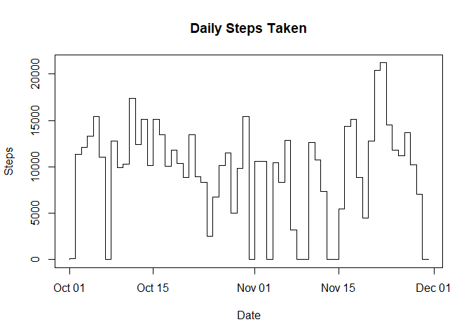
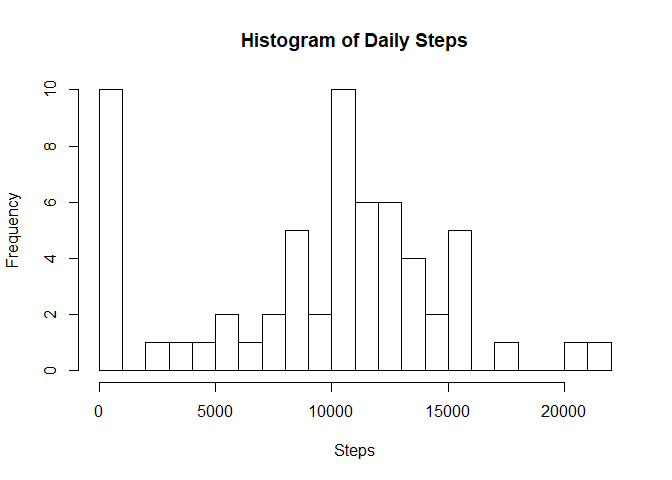

Reproducible Research Week2 Peer Project1
=========================================

### Reading and transforming data

#### Load and process/transform the data (if necessary) into a format suitable for your analysis:

    library(data.table)
    library(dplyr)
    data = read.csv("./activity.csv")
    data_daily = group_by(data, date)
    daily_sum = as.data.frame(summarise_at(data_daily, "steps", sum, na.rm = TRUE))
    daily_sum$date = as.Date(daily_sum$date)

#### Calculate the total number of steps taken per day:

    plot(daily_sum$date,daily_sum$steps, type = "S", main = "Daily Steps Taken", xlab = "Date", ylab = "Steps")

### Average of Daily Steps Taken

#### Make a histogram of the total number of steps taken each day:

    hist(daily_sum$steps, breaks = 30, main = "Histogram of Daily Steps", xlab = "Steps")

#### Calculate and report the mean and median of the total number of steps taken per day:

    mean_daily = mean(daily_sum$steps)
    median_daily = median(daily_sum$steps)

The calculated Mean and Medians are **9354.23** and **10395** ,
respectively.

### Average Pattern of Daily Activity

#### Make a time series plot (i.e. type = "l") of the 5-minute interval (x-axis) and the average number of steps taken, averaged across all days (y-axis):

    data_interval = group_by(data, interval)
    interval_average = as.data.frame(summarise_at(data_interval, "steps", mean, na.rm = TRUE))
    plot(interval_average$interval,interval_average$steps, type = "l", main = "Daily Activity Pattern", xlab = "Interval", ylab = "Steps")

#### Which 5-minute interval, on average across all the days in the dataset, contains the maximum number of steps?

    max_value = max(interval_average$steps)
    max_index = interval_average$interval[interval_average$steps == max_value]

Maximum is happening at **835** interval and the value is **206.17**

### Data Evaluation

#### Calculate and report the total number of missing values in the dataset (i.e. the total number of rows with NAs):

    NA_number = sum(is.na(data$steps))

There are **2304** missing values in this data.

#### Devise a strategy for filling in all of the missing values in the dataset:

Here, The interval average is chosen to be used to substitute for NA
values.

#### Create a new dataset that is equal to the original dataset but with the missing data filled in:

    new_data = merge(data, interval_average, by = "interval")
    new_data$date = as.Date(new_data$date)
    colnames(new_data) = c("interval","steps","date","average step")
    example1 = head(new_data)
    new_data$steps[is.na(new_data$steps)] = new_data$`average step`[is.na(new_data$steps)]
    example2 = head(new_data)

For this, interval averages calcuclated in previous steps
(interval\_average) is merged with the initial data set (data), based on
the interval ID. As an illustration if we look at the first 6th rows of
the inital data, we notice that first entry is NA.

    ##   interval steps       date average step
    ## 1        0    NA 2012-10-01     1.716981
    ## 2        0     0 2012-11-23     1.716981
    ## 3        0     0 2012-10-28     1.716981
    ## 4        0     0 2012-11-06     1.716981
    ## 5        0     0 2012-11-24     1.716981
    ## 6        0     0 2012-11-15     1.716981

but after our conversion, this NA value is repaced by the average of
steps in that interval. See below.

    ##   interval    steps       date average step
    ## 1        0 1.716981 2012-10-01     1.716981
    ## 2        0 0.000000 2012-11-23     1.716981
    ## 3        0 0.000000 2012-10-28     1.716981
    ## 4        0 0.000000 2012-11-06     1.716981
    ## 5        0 0.000000 2012-11-24     1.716981
    ## 6        0 0.000000 2012-11-15     1.716981

#### Make a histogram of the total number of steps taken each day and Calculate and report the mean and median total number of steps taken per day. Do these values differ from the estimates from the first part of the assignment? What is the impact of imputing missing data on the estimates of the total daily number of steps?

    new_data_daily = group_by(new_data, date)
    new_daily_sum = as.data.frame(summarise_at(new_data_daily, "steps", sum))
    new_daily_sum$date = as.Date(new_daily_sum$date)
    hist(new_daily_sum$steps, breaks = 30, main = "NEW Histogram of Daily Steps", xlab = "Steps")

    new_mean_daily = mean(new_daily_sum$steps)
    new_median_daily = median(new_daily_sum$steps)

The new calculated Mean and Medians are **1.07661910^{4}** and
**1.076618910^{4}** , respectively. Both these value have increased as
compared to the previous case. In this new case median and mean are the
same value. Summary is shown in table below:

    ##          Before    After
    ## Mean    9354.23 10766.19
    ## Median 10395.00 10766.19

### Are there differences in activity patterns between weekdays and weekends?

#### Create a new factor variable in the dataset with two levels – “weekday” and “weekend” indicating whether a given date is a weekday or weekend day:

    new_data$Weekday = weekdays(new_data$date)
    weekdays <- c('Monday', 'Tuesday', 'Wednesday', 'Thursday', 'Friday')
    new_data$wday = factor(new_data$Weekday%in%weekdays, levels = c(FALSE,TRUE), labels = c("Weekend","Weekday"))
    head(new_data$Weekday)

    ## [1] "Monday"   "Friday"   "Sunday"   "Tuesday"  "Saturday" "Thursday"

    head(new_data$wday)

    ## [1] Weekday Weekday Weekend Weekday Weekend Weekday
    ## Levels: Weekend Weekday

#### Make a panel plot containing a time series plot (i.e. type = "l") of the 5-minute interval (x-axis) and the average number of steps taken, averaged across all weekday days or weekend days (y-axis).

First the average steps taken for each interval is calculated for
Weekend and Weekdays:

    new_data = group_by(new_data,wday)
    new_data = group_by(new_data,interval,add = TRUE)
    new_data_average = as.data.frame(summarise_at(new_data, "steps", mean))
    head(new_data_average)

    ##      wday interval       steps
    ## 1 Weekend        0 0.214622642
    ## 2 Weekend        5 0.042452830
    ## 3 Weekend       10 0.016509434
    ## 4 Weekend       15 0.018867925
    ## 5 Weekend       20 0.009433962
    ## 6 Weekend       25 3.511792453

Then this new dataset is used for plotting.

    library(ggplot2)
    qplot(interval, steps, data = new_data_average, color = wday, facets = wday ~., geom = "path")

    #par(mfrow = c(2, 1))
    #with(subset(new_data_average, wday=="Weekend"), plot(interval, steps, col = "Red", type = "l", main = "Weekend"))
    #with(subset(new_data_average, wday=="Weekday"), plot(interval, steps, col = "Blue", type = "l", main = "Weekdays"))
